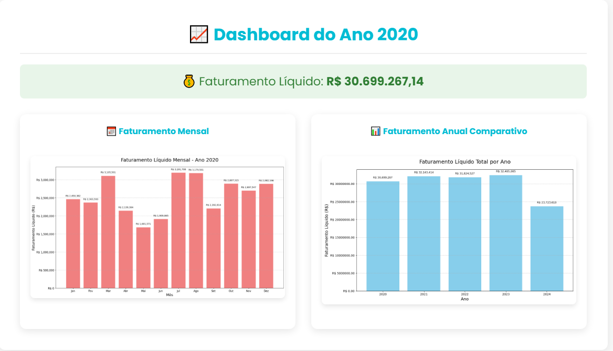

-----

# **Nome do seu Projeto**

**Dashboard de Previsão de Lucro para Energia Eólica**

\<p align="center"\>
\
\</p\>

## Sobre o Projeto

Este projeto é uma aplicação web completa que combina um **site institucional** para uma empresa de energia eólica com uma **ferramenta interativa de análise e previsão de lucro**. A plataforma utiliza **modelos de Machine Learning** baseados em dados climáticos simulados para prever a produção de energia e, consequentemente, o lucro da empresa em uma data futura.

O principal objetivo é demonstrar como a análise de dados pode ser integrada a uma aplicação web para fornecer insights valiosos e auxiliar na tomada de decisões estratégicas no setor de energias renováveis.

## Tecnologias Utilizadas

O projeto foi desenvolvido utilizando as seguintes tecnologias:

**Back-end:**

  * **Python:** Linguagem principal para a lógica de negócio e análise de dados.
  * **Flask:** Framework web para criar o servidor e as APIs.
  * **Pandas:** Manipulação e análise de dados.
  * **Scikit-learn:** Construção e treinamento do modelo de previsão de Machine Learning.

**Front-end:**

  * **HTML, CSS, JavaScript:** Estrutura, estilização e interatividade da interface.
  * **Plotly.js:** Biblioteca para a criação de gráficos interativos do dashboard.

## Funcionalidades

  * **Site Institucional:** Páginas sobre a empresa, sua missão, tecnologias e informações de contato.
  * **Dashboard Interativo:** O usuário pode selecionar uma data e o sistema prevê o lucro com base em dados simulados de vento e custos operacionais.
  * **Modelo de Previsão:** Um modelo de Machine Learning que correlaciona a velocidade do vento com a produção de energia, servindo de base para o cálculo de lucro.
  * **Análise de Dados:** Visualização de dados históricos para contextualizar as previsões.

## Como Executar o Projeto

Siga os passos abaixo para rodar o projeto em sua máquina local:

1.  **Clone o repositório:**

    ```bash
    git clone https://github.com/SeuUsuario/NomeDoSeuRepositorio.git
    cd NomeDoSeuRepositorio
    ```

2.  **Crie e ative um ambiente virtual (recomendado):**

    ```bash
    python -m venv venv
    # No Windows
    venv\Scripts\activate
    # No macOS/Linux
    source venv/bin/activate
    ```

3.  **Instale as dependências:**

    ```bash
    pip install -r requirements.txt
    ```

4.  **Execute a aplicação Flask:**

    ```bash
    python app.py
    ```

5.  Abra seu navegador e acesse: `http://127.0.0.1:5000`

## Estrutura do Projeto

```
.
├── app.py                  # Aplicação Flask principal
├── requirements.txt        # Dependências do projeto
├── data/
│   ├── simulated_data.csv  # Dados simulados para análise
│   └── power_curve.csv     # Dados da curva de potência
├── models/
│   └── prediction_model.pkl # Modelo de ML treinado
├── static/
│   ├── css/
│   │   └── style.css       # Folha de estilo do projeto
│   └── js/
│       └── scripts.js      # Lógica JavaScript do dashboard
└── templates/
    ├── index.html          # Página inicial do site
    ├── dashboard.html      # Página do dashboard
    └── ...                 # Outras páginas HTML
```

## Contribuições

Este projeto foi desenvolvido como um **projeto de portfólio**. Contribuições são bem-vindas\! Sinta-se à vontade para abrir uma *issue* ou enviar um *pull request*.

## Autor

CALEBE SIMOES PEREIRA

  * [LinkedIn]www.linkedin.com/in/calebe-simões
  * [GitHub]https://github.com/CalebeSimoes
  * [Portfólio Pessoal] Loading...

-----

\*Este README foi gerado para o projeto de **TODA CORPORATION**.
